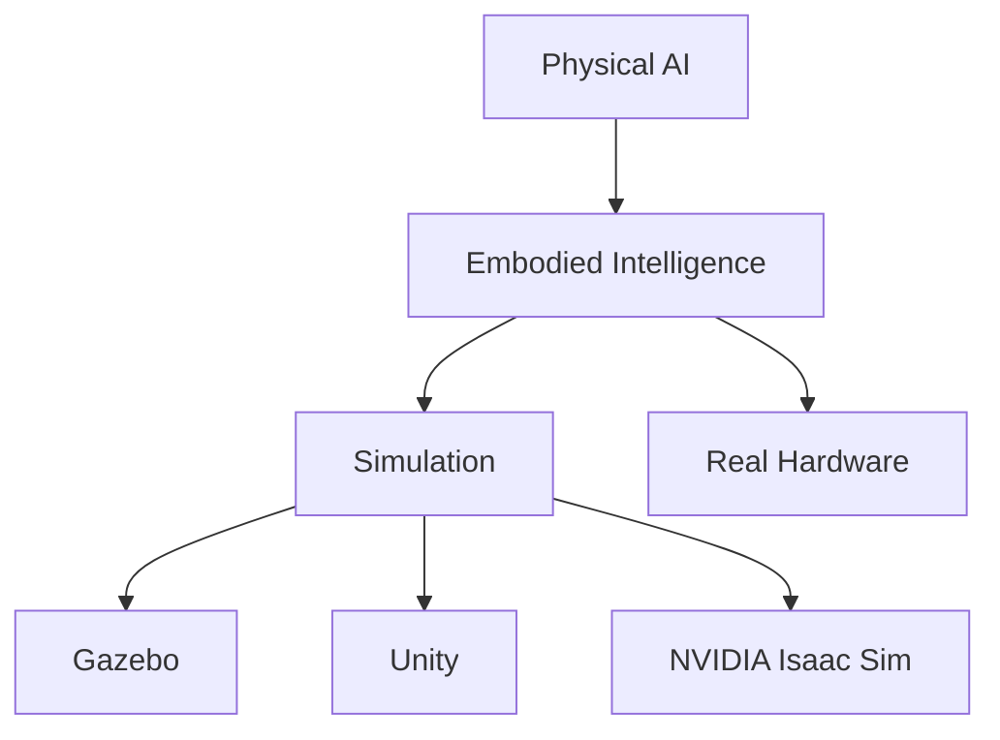

# Quickstart Guide: Physical AI & Humanoid Robotics Book

## Overview

This quickstart guide will help you set up the development environment for the Physical AI & Humanoid Robotics book project. This guide covers setting up Docusaurus, understanding the project structure, and making your first contribution.

## Prerequisites

Before starting, ensure you have the following installed on your system:

- **Node.js**: Version 18 or higher
- **npm**: Version 9 or higher (or yarn v3+)
- **Git**: Version 2.0 or higher
- **A code editor**: VS Code, Vim, Emacs, or your preferred editor

## Setting Up the Development Environment

### 1. Clone the Repository

```bash
git clone https://github.com/[your-org]/physical-ai-book.git
cd physical-ai-book
```

### 2. Install Dependencies

```bash
npm install
# or if using yarn
yarn install
```

### 3. Start the Development Server

```bash
npm start
# or if using yarn
yarn start
```

This command starts a local development server and opens the website in your browser at `http://localhost:3000`.

## Project Structure

Understanding the project structure is crucial for contributing effectively:

```
physical-ai-book/
├── docs/
│   ├── intro.md
│   ├── part-i-foundations/
│   │   ├── chapter-1-introduction-to-physical-ai.md
│   │   └── chapter-2-embodied-intelligence.md
│   ├── part-ii-ros/
│   │   ├── chapter-3-ros-2-architecture.md
│   │   ├── chapter-4-ros-2-with-python.md
│   │   └── chapter-5-robot-description.md
│   └── ... (other parts and chapters)
├── docusaurus.config.js
├── sidebars.js
├── static/
├── src/
│   ├── components/
│   ├── pages/
│   └── css/
├── package.json
└── README.md
```

### Key Directories and Files:

- `docs/`: Contains all the book content in Markdown format
- `docusaurus.config.js`: Main configuration file for the Docusaurus site
- `sidebars.js`: Defines the navigation structure for the book
- `static/`: Contains static assets like images and downloadable resources
- `src/`: Contains custom React components and pages

## Creating Your First Chapter

### 1. Create a New Markdown File

Create a new Markdown file in the appropriate directory under `docs/`. For example, to create a new chapter in Part I:

```bash
touch docs/part-i-foundations/chapter-3-another-topic.md
```

### 2. Add Frontmatter

At the beginning of your Markdown file, add the required frontmatter:

```markdown
---
title: Another Topic in Physical AI
sidebar_position: 3
description: Learn about another important topic in Physical AI
---

# Another Topic in Physical AI

Your chapter content goes here...
```

### 3. Update Sidebars

Add your new chapter to the `sidebars.js` file so it appears in the navigation:

```javascript
module.exports = {
  docs: [
    {
      type: 'category',
      label: 'Part I - Foundations of Physical AI',
      items: [
        'intro',
        'part-i-foundations/chapter-1-introduction-to-physical-ai',
        'part-i-foundations/chapter-2-embodied-intelligence',
        'part-i-foundations/chapter-3-another-topic', // Add this line
      ],
    },
    // ... other parts
  ],
};
```

## Content Guidelines

### Markdown Format

All content should follow standard Markdown format with these additional features:

- **Admonitions**: Use special blocks for notes, tips, warnings:
  ```markdown
  :::note
  This is a note.
  :::

  :::tip
  This is a helpful tip.
  :::

  :::warning
  This is a warning.
  :::
  ```

- **Code Blocks**: Include syntax highlighting:
  ```markdown
  ```python
  import rospy

  def main():
      rospy.init_node('my_node')
      rate = rospy.Rate(10)
      while not rospy.is_shutdown():
          print("Hello, ROS!")
          rate.sleep()
  ```
  ```

### Diagrams and Images

Place images in the `static/img/` directory and reference them using the following syntax:

```markdown

```

For complex diagrams, consider using Mermaid syntax:

```markdown

```

## Building and Deploying

### Build for Production

To build the static files for production:

```bash
npm run build
# or if using yarn
yarn build
```

### Local Preview of Production Build

To preview the production build locally:

```bash
npm run serve
# or if using yarn
yarn serve
```

### Deployment

The site is configured for deployment to GitHub Pages. When you push changes to the `main` branch, GitHub Actions will automatically build and deploy the site.

## Running Tests

To ensure content quality, run the following commands:

```bash
# Check for broken links
npm run lint:links

# Validate Markdown formatting
npm run lint:md
```

## Contributing

### 1. Create a New Branch

```bash
git checkout -b feature/your-feature-name
```

### 2. Make Your Changes

Edit the Markdown files in the `docs/` directory or other relevant files.

### 3. Commit Your Changes

```bash
git add .
git commit -m "Add: New chapter on [topic]"
```

### 4. Push and Create a Pull Request

```bash
git push origin feature/your-feature-name
```

Then create a pull request on GitHub.

## Need Help?

- Check the [specification](./spec.md) for detailed requirements
- Review the [implementation plan](./plan.md) for architectural decisions
- Look at existing chapters for formatting examples
- Ask questions in the project's issue tracker

## Next Steps

1. Review the [data model](./data-model.md) to understand content structure
2. Explore the [research findings](./research.md) for technical decisions
3. Check the [task breakdown](./tasks.md) for planned work
4. Start writing your first chapter!